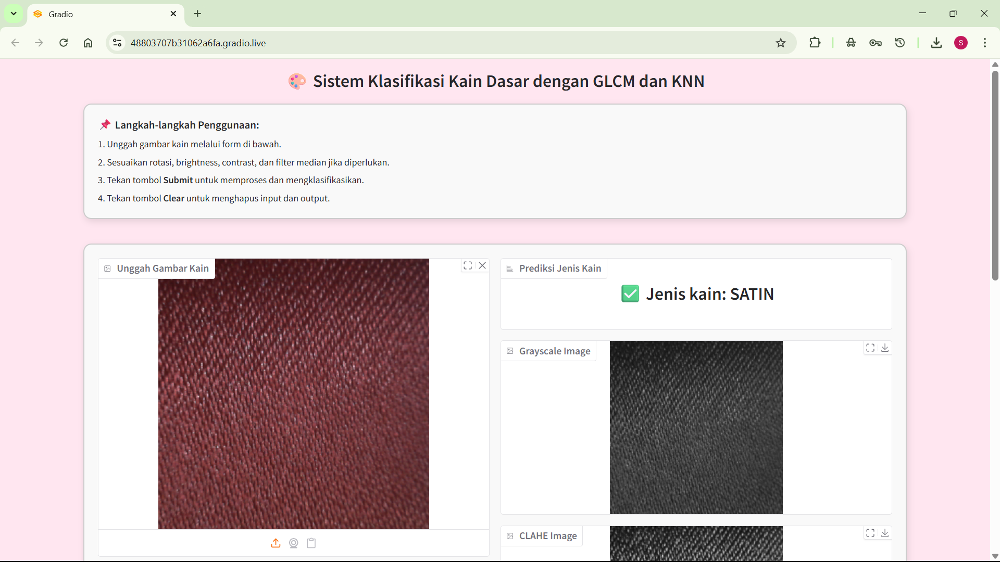

---

# **IMPLEMENTASI EKSTRAKSI FITUR MENGGUNAKAN GRAYLEVEL CO-OCCURRENCE MATRICES (GLCM) DAN K-NEAREST NEIGHBOR (K-NN) UNTUK KLASIFIKASI JENIS KAIN DASAR**

---

**Tugas Pengolahan Citra**
---

**Nama Anggota :**
1. Laili Athiyyah - 065122146
2. Syahrina Aryani D. - 065122159

**Link Sumber Data :** https://www.kaggle.com/datasets/orchit/the-fabrics-dataset-by-ibug

**Link GDrive (Dataset Kain):** https://drive.google.com/file/d/1FvVlBlXCJ7p5Y_HqFtlYoONKieqBsx9U/view?usp=sharing
